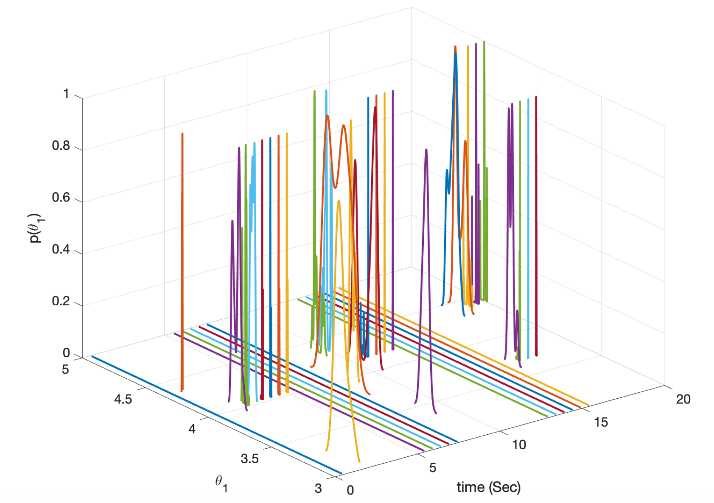
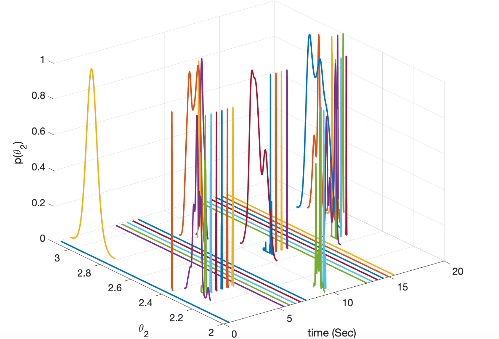
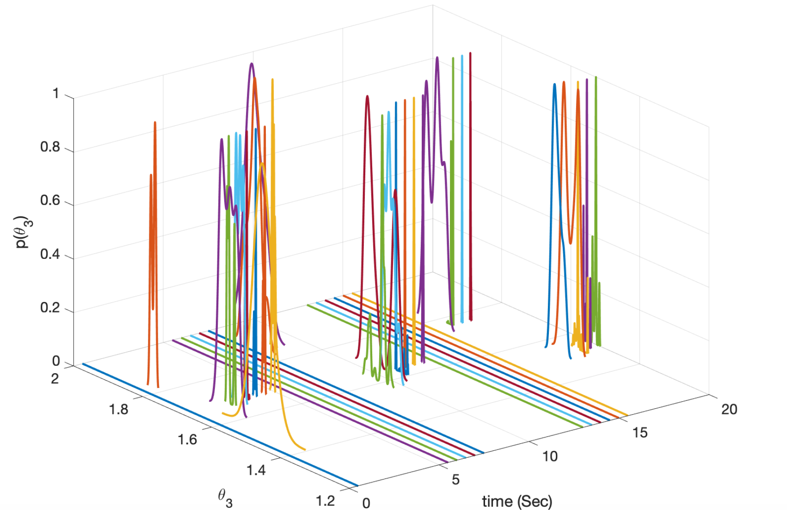
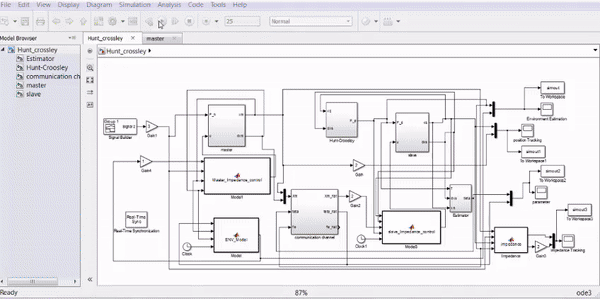
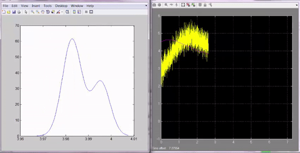

# ARMCMC
Adaptive Recursive Markov Chain Monte Carlo

This project lists all of the deliverables for the ARMCMC paper in RA-L/ IROS 2023.


## Requirements
* MATLAB
* SIMULINK
* C-MEX compiler in MATLAB

## Instructions
1. Move the `main.m` and `armcmc.m` folders to `ARMCMC/src` directory.
2. Run `armcmc.m` in the `dataset` directory for different dataset.
3. Generating the results:

&nbsp;&nbsp;&nbsp;&nbsp; 3.1. Hunt-crossley `cd experiments/hunt-crossley` and

&nbsp;&nbsp;&nbsp;&nbsp; 3.2. Fluid soft bend `cd experiments/Fluid-bend` and

&nbsp;&nbsp;&nbsp;&nbsp; 3.3. Real data soft contact `cd experiments/soft-contact` and run `mex [].c` in MATLAB console to genereate mex files and


run the mld file(s) for model and appaorch integrated in simulink (refer to the readme on that directory).

4. For producing the figures, `cd src/data/` and run either of the plotting codes.

## Results
### Hunt-Crossley:
| K_e    | B_e  | n_e   |
| :---------------------: | :------------------------------------: | :-----------: |
|  |  |  |


### Project Demo:

|RLS approach  | Instant probability of K_e for ARMCMC |
| :---------------------: | :------------------------------------: |
| |  |

### Supplementary Material:
* [MCMC](https://github.com/mjlaine/mcmcstat)

## How to cite:

```
@inproceedings{agand2022online,
  title={Online Probabilistic Model Identification using Adaptive Recursive MCMC},
  author={Agand, Pedram and Chen, Mo and Taghirad, Hamid D},
  booktitle={2019 International Joint Conference on Neural Networks (IJCNN)},
  pages={1--6},
  year={2023},
  organization={IEEE}
}
```
